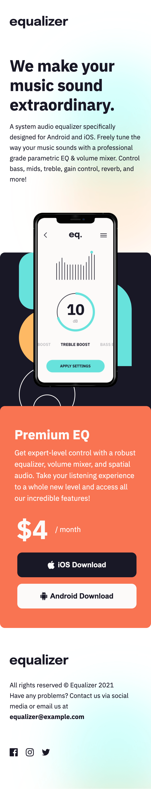
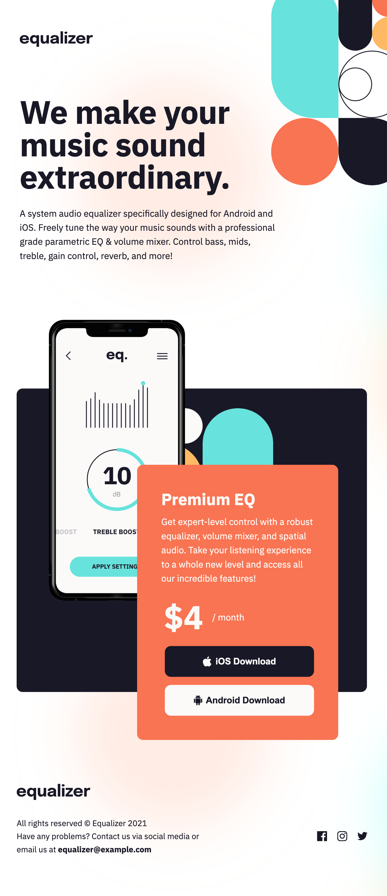
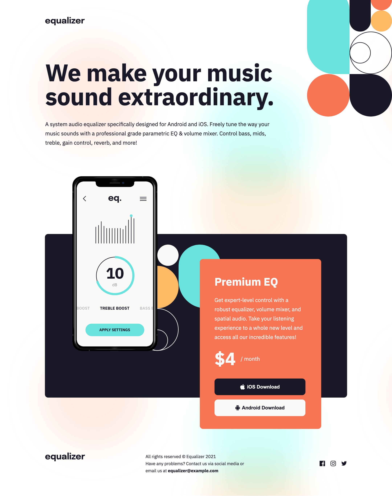

# Frontend Mentor - Equalizer landing page solution

This is a solution to the [Equalizer landing page challenge on Frontend Mentor](https://www.frontendmentor.io/challenges/equalizer-landing-page-7VJ4gp3DE). Frontend Mentor challenges help you improve your coding skills by building realistic projects.

## Table of contents

- [Overview](#overview)
  - [The challenge](#the-challenge)
  - [Screenshot](#screenshot)
  - [Links](#links)
- [My process](#my-process)
  - [Built with](#built-with)
- [Author](#author)

## Overview

### The challenge

Users should be able to:

- View the optimal layout depending on their device's screen size
- See hover states for interactive elements

### Screenshot

### Links

- Solution URL: [https://github.com/NunoAzevedo17/equalizer-landing](https://github.com/NunoAzevedo17/equalizer-landing)
- Live Site URL: [https://nunoazevedo17.github.io/equalizer-landing](https://nunoazevedo17.github.io/equalizer-landing)

## My process

### Built with

- HTML
- CSS

## Author

- Website - [Add your name here](https://www.your-site.com)
- Frontend Mentor - [@nunoazevedo17](https://www.frontendmentor.io/profile/nunoazevedo17)
